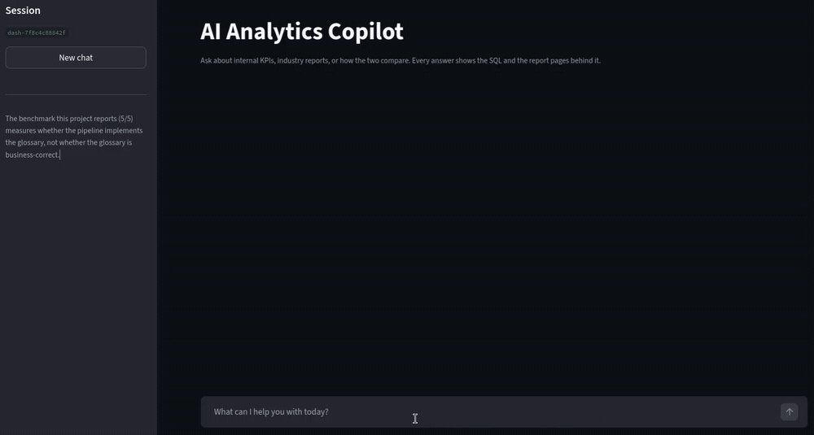

# AI Analytics Copilot

Ask a business question in plain English. The copilot decides whether the answer
lives in the company database, in a shelf of industry and competitor PDFs, or in
both, runs those branches, and writes a short report with the SQL and the source
pages attached.

It has two halves. Text-to-SQL runs against a business glossary rather than a
raw schema, so "return rate" means one specific formula on one specific table.
RAG runs hybrid BM25 and vector search over 12 annual and industry reports, and
cites document, page, and year for every claim.

Databricks Genie, Snowflake Cortex Analyst and ThoughtSpot Sage solve the same
problem commercially. This is a prototype built to understand how, not a
competitor to them.

---

# Demo



One question, both branches. The router classifies it as `both`. The SQL branch
computes the order-level return rate from `mart_order_summary` while the RAG
branch searches the report corpus, then the merge step writes the report. The
generated SQL and the retrieved pages sit one click away under each answer.

---

# System architecture

```text
                    ┌────────────────────────────┐
                    │   User Business Question   │
                    └─────────────┬──────────────┘
                                  │
                                  ▼
                    ┌────────────────────────────┐
                    │      classify (LLM)        │
                    │ sql_only / rag_only / both │
                    └─────────────┬──────────────┘
                                  │
                 ┌────────────────┴────────────────┐
                 │        (run concurrently)       │
                 ▼                                 ▼
   ┌──────────────────────────┐      ┌──────────────────────────┐
   │   Governed Text-to-SQL   │      │      Advanced RAG        │
   │ glossary retrieval       │      │ hybrid BM25 + vector     │
   │ → prompt → LLM → SQL     │      │ → RRF fusion → cited     │
   │ → SQLite execution       │      │   answer over 12 PDFs    │
   └────────────┬─────────────┘      └────────────┬─────────────┘
                │  DataFrame + SQL                │  answer + source chunks
                └────────────────┬────────────────┘
                                 ▼
                   ┌───────────────────────────┐
                   │    merge (LLM → JSON)     │
                   │ PM report, no fabrication │
                   └─────────────┬─────────────┘
                                 ▼
                   ┌───────────────────────────┐
                   │  Streamlit chat + charts  │
                   │  SQL / data / sources     │
                   └───────────────────────────┘
```

One shared conversation memory (`src/rag/memory.py`) feeds the classifier, the
RAG chain, and the merge step, so follow-up questions resolve against earlier
turns.

A separate path benchmarks the SQL branch on its own. See
[SQL evaluation framework](#sql-evaluation-framework).

---

# Governed analytics layer

The pipeline never hands the model a raw schema and hopes. Before generating
SQL it retrieves:

* KPI definitions
* approved business logic
* preferred marts/views
* metric constraints
* semantic business rules
* schema relationships

before prompting the LLM.

Current implementation includes:

- KPI glossary retrieval
- business metric mapping
- preferred source selection
- time period identification
- prompt construction
- SQL execution validation

Vector-based document retrieval is implemented and in use. The RAG branch runs
hybrid BM25 and vector search with RRF fusion over 12 report PDFs (`src/rag/`),
and the router runs it alongside the SQL branch.

The point of all this is narrow and worth stating plainly. The glossary decides
which table and which formula the model uses, so two people asking the same
question in different words get the same number. It does not make the glossary
itself correct.

---

# Repository structure

```text
AI-Analytics-Chatbot/
│
├── app/
│   ├── dashboard.py            # Streamlit chat UI (primary entry point)
│   ├── charts.py               # chart selection for SQL results (pure, tested)
│   ├── app.py                  # SQL-only CLI loop
│   └── copilot.py              # unified copilot CLI (router → SQL + RAG → PM report)
│
├── src/
│   ├── llm.py                  # shared HuggingFace chat + embedding providers
│   ├── router.py               # route classification, parallel execution, merge
│   │
│   ├── sql_agent/
│   │   ├── config.py           # canonical paths (glossary, database, test cases)
│   │   ├── retriever.py        # glossary metric retrieval + live schema lookup
│   │   ├── prompt_builder.py   # metric/schema/time-rule prompt assembly
│   │   ├── sql_generator.py    # LLM call + SQL extraction
│   │   ├── sql_executor.py     # SQLite execution
│   │   ├── sql_pipeline.py     # retrieve → prompt → generate → execute
│   │   ├── sql_evaluator.py    # result comparison
│   │   └── accuracy_report.py  # end-to-end benchmark runner
│   │
│   └── rag/
│       ├── config.py           # models, chunk sizes, paths
│       ├── parsing.py          # PDF parsing + metadata tagging
│       ├── vectorstore.py      # parent/child chunking, Chroma
│       ├── retrieval.py        # hybrid BM25 + vector with RRF fusion
│       ├── chain.py            # RAG prompt + chain assembly
│       ├── memory.py           # conversation window + SQLite persistence
│       ├── clarification.py    # vague-question detection
│       ├── conversation.py     # multi-turn loop
│       └── main.py             # RAG-only demo
│
├── config/
│   └── glossary.json           # KPI definitions, formulas, business rules
│
├── data/
│   ├── database/               # thelook_ecommerce.db (built, gitignored)
│   ├── reports/                # 12 annual + industry PDFs
│   ├── evaluation/
│   │   └── test_cases.json     # benchmark questions + expected SQL
│   └── processed/              # sessions.db (created at runtime)
│
├── scripts/
│   └── build_db.py             # reproducible database builder
│
├── tests/
│   ├── test_extract_sql.py
│   ├── test_sql_evaluator.py
│   ├── test_charts.py
│   ├── test_chain.py           # RAG context formatting / citations
│   ├── test_rag_parsing.py     # year + doc_type from filenames
│   ├── test_rag_retrieval.py   # RRF fusion + metadata filtering
│   └── test_glossary_schema.py # glossary ↔ live schema consistency
│
├── .github/workflows/tests.yml # pytest on push and PR
│
├── notebooks/                  # historical exploration (01–05)
├── outputs/                    # evaluation reports
│
├── requirements.txt
├── requirements-dev.txt
├── .python-version
└── README.md
```

---

# Data warehouse and analytics marts

SQLite is the warehouse. Five marts sit on top of the seven base tables so
metric queries hit one pre-joined table at a known grain instead of
reconstructing the join every time.

## Implemented marts

| Mart | Purpose |
|--------|---------|
| mart_daily_sales | Daily sales and revenue reporting |
| mart_order_summary | Order-level profitability and fulfillment metrics |
| mart_product_sales | Product and category performance analytics |
| mart_user_summary | Customer purchasing behaviour |
| mart_user_segment | Customer lifecycle segmentation |

---

# SQL evaluation framework

The benchmark runs generated SQL and expected SQL against the same database and
compares the results, so a query that is worded differently but returns the
same rows passes.

## What it checks

* Ground truth SQL benchmarking (`src/sql_agent/accuracy_report.py`)
* Result-based validation: equivalent SQL passes, identical text is not required
* Shape check, then per-column comparison. Numeric with tolerance, text exact
* Pass / fail scoring with execution-error tracing
* CSV report written to `outputs/`
* Glossary ↔ live schema consistency checks (`tests/test_glossary_schema.py`)

Semantic business-rule validation was prototyped and removed. It is listed
under future improvements rather than described as working.

---

# Evaluation pipeline

```text
Question
↓
Expected SQL
↓
Generated SQL
↓
SQL Execution
↓
Result Comparison
↓
Pass / Fail Report
```

---

# Benchmark and ground truth

I wrote the benchmark cases by hand.

## Coverage

Five cases in `data/evaluation/test_cases.json`, covering KPI aggregation
(revenue, AOV), ranking with grouping (top categories), time filtering,
customer activity windows, and return analysis.

Each case contains:

* natural language question
* expected SQL, derived from `config/glossary.json` and tagged with
  `expected_sql_source`

The runner executes expected and generated SQL against the same database and
compares results. That measures whether the pipeline implements the glossary. It
says nothing about whether the glossary is business-correct.

---

# How the pieces fit

**Glossary-governed SQL.** `config/glossary.json` holds the formula, the
preferred mart, and the business rules for each metric. The retriever pulls the
two most relevant metrics into the prompt alongside a one-line schema per table
from SQLite `PRAGMA`. The model picks the table it is told to pick.

**Hybrid document retrieval.** BM25 catches exact strings such as "return rate
40%", vector search catches paraphrases, and RRF fusion merges the two ranked
lists at 0.4 and 0.6. Filters for year and document type narrow both layers at
once, and fall back to the full corpus when nothing matches rather than
returning an empty result that reads like "no answer exists".

**Result-based evaluation.** Generated SQL is judged on the rows it returns, not
on string similarity to a reference query. Execution errors are traced to the
failing case.

**A merge step that will say "N/A".** The report prompt forbids numbers that do
not appear literally in the retrieved material. A failed or empty branch becomes
"N/A" instead of a plausible invention, and the dashboard shows the failure
rather than hiding it behind the report.

---

# Getting started

## 1. Requirements

Python **3.11–3.13**. Not 3.14: every published version of `unstructured`,
which parses the report PDFs, requires `<3.14`. `.python-version` pins 3.13 for
`uv` and `pyenv` users.

```bash
git clone https://github.com/ChoWingDev/AI-Analytics-Chatbot.git
cd AI-Analytics-Chatbot
```

---

## 2. Environment

```bash
python3 -m venv .venv
source .venv/bin/activate
pip install -r requirements.txt
```

---

## 3. Credentials

```bash
cp .env.example .env
```

Then fill in:

| variable | where to get it | needed for |
|---|---|---|
| `HF_TOKEN` | [huggingface.co/settings/tokens](https://huggingface.co/settings/tokens) (Read scope) | every LLM call |
| `KAGGLE_USERNAME`, `KAGGLE_KEY` | [kaggle.com/settings/account](https://www.kaggle.com/settings/account) → Create New Token | building the database |

Kaggle credentials are only needed for the download. `build_db.py --csv-dir`
accepts CSVs you already have.

---

## 4. Build the database

```bash
python scripts/build_db.py
```

Downloads TheLook, loads 7 base tables (~2.4M events rows), and builds the 5
analytics marts. Produces roughly 528 MB at
`data/database/thelook_ecommerce.db`. Takes a few minutes.

---

## 5. Run

```bash
streamlit run app/dashboard.py   # start here
```

Then open http://localhost:8501. Command-line entry points still work:

```bash
python -m app.copilot     # unified copilot: internal KPIs + industry reports
python -m app.app         # SQL-only loop
python -m src.rag.main    # RAG-only demo
```

The first run that touches RAG parses all 12 PDFs and embeds about 105k chunks
on CPU, which takes around 15 minutes. Results are cached to
`data/parsed_docs.pkl` and `chroma_db/`, so later runs start in seconds.

---

## 6. Tests and benchmark

```bash
pip install -r requirements-dev.txt
pytest                                    # unit tests
python -m src.sql_agent.accuracy_report   # end-to-end Text-to-SQL benchmark
```

`tests/test_glossary_schema.py` checks every glossary metric against the live
database schema, and skips if the database has not been built.

---

## A note on the data

`scripts/build_db.py` pulls the Kaggle mirror
`mustafakeser4/looker-ecommerce-bigquery-dataset`. TheLook is synthetic and
regenerated over time, so each mirror is a different snapshot. **This is not the
same data the project's original numbers came from.** The same query for
January 2021 category revenue returns 4,355.92 for Outerwear & Coats today
versus 7,506.91 originally, and the difference is not a constant factor.

Any figure in the notebooks predates the current snapshot. `outputs/sql_evaluation_result.csv` and
`src/sql_agent/sql_accuracy_report.csv` are kept in the repo as the record of
the original dataset's values.

The benchmark in `data/evaluation/test_cases.json` is unaffected. It executes
expected and generated SQL against the *same* database, so it measures whether
the pipeline implements `config/glossary.json`, not whether the glossary is
business-correct.

---

# Current results

Text-to-SQL benchmark: **5 / 5** against the current snapshot
(`python -m src.sql_agent.accuracy_report`).

Unit tests: **85 passing**, covering SQL extraction, result comparison, glossary
and schema consistency, RAG parsing, rank fusion, retrieval filtering, context
formatting, chart selection, and the clarification gate. They run in CI on every
push with no database, no vector store, and no API token.

The benchmark number needs its caveat every time it is quoted. Expected SQL comes
from the same glossary the pipeline reads, so a passing score proves the pipeline
implements the glossary. It is a consistency measure, not an independent accuracy
measure.

Getting there was almost entirely glossary work. Every accuracy gain came from
fixing a metric definition, not from prompt wording or model choice. The largest
single jump came from pinning category revenue to one mart after two queries for
the same question disagreed, traced to 2.46% of `order_items.created_at` values
falling into a different day than `orders.created_at` once `DATE()` truncated
them.

---

# What works, and what does not

**Works**

* Working demo in the browser. Routing, parallel SQL and RAG, merged report,
  charts, and the SQL and source pages behind every answer
* 5/5 on the Text-to-SQL benchmark, 85 unit tests, CI green on push
* Answers cite source document, page, year, and document type
* The merge prompt refuses to invent numbers. A failed branch becomes "N/A"
  rather than a plausible fabrication, and the dashboard shows the failure

**Does not work, or is not what it looks like**

* **The 5/5 benchmark is a consistency measure.** Expected SQL is derived from
  the same `config/glossary.json` the pipeline reads. It proves the pipeline
  implements the glossary; it cannot detect a glossary that is business-wrong.
* **The merge step compares metrics without checking their grain.** The return
  rate here is order-level, 10.01%, the share of orders containing a return.
  Published industry return rates are usually unit-level (the share of items
  returned). Nothing in the pipeline knows the difference, so when both numbers
  are present it will label the gap "Above" or "Below average" on a comparison
  that is not like-for-like. Check both grains yourself before believing a
  status. When no industry figure is retrieved the report says "N/A" rather than
  inventing one, so that guard works. Grain awareness is the missing part.
* **Three glossary metrics are unaudited.** `aov`, `active_users` and
  `conversion_rate` pass the schema tests, but their business logic has not had
  the review `return_rate` received. `conversion_rate` queries the raw `events`
  table because no funnel mart exists.
* **Single user.** The dashboard caches one agent per server process and that
  agent holds one conversation memory. Concurrent users would interleave.
* **Not deployed.** About 898 MB of runtime artifacts, a 528 MB database, 354 MB
  of Chroma, a 17 MB parse cache, plus 8 to 13 seconds per answer. Free hosting
  would make a bad demo of it. It runs locally.
* **Numbers in the notebooks predate the current data snapshot.** See the note
  on the data above.

---

# Future improvements

* OpenAI function-calling router
* dynamic schema retrieval
* SQL confidence scoring
* semantic KPI matching
* ambiguity detection
* production SQL sandboxing
* semantic business-rule validation (prototyped, then removed)
* automated RAG evaluation
* LLM-generated SQL benchmarking
* grain-aware metric comparison in the merge step
* audit of the remaining glossary metrics
* hybrid SQL + document reasoning

---

# License

This project is licensed under the MIT License.